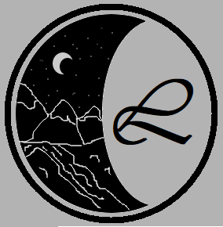
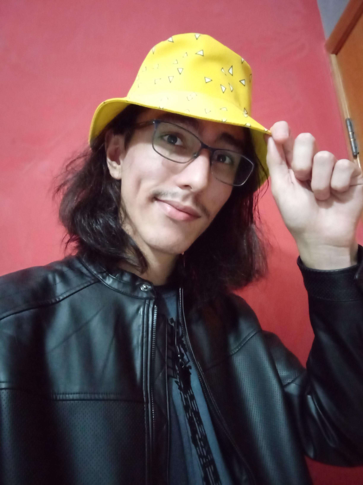
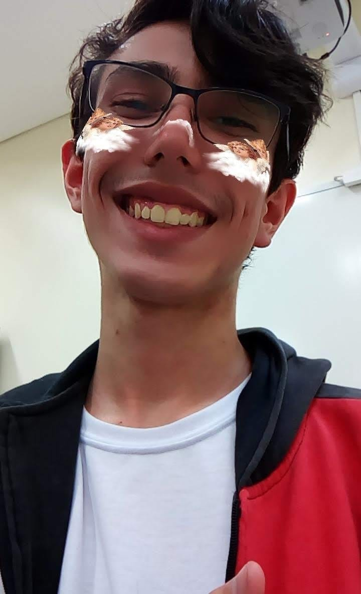

  
  <h1>Hey There!👋</h1>
  

    <li>My name's Augusto Henrique Buin, and I have 22 years!</li>
    <li>I'm a Fullstack Developer who loves interacting with other people. 
</li>
    <li>Here's a quote for you: J.R.R. Tolkien said "There can be no triumph without loss, No victory without suffering, No freedom without sacrifice", and he's right, you cannot grow if you are not encouraged to do so. </li>
  

     
<!--  
 Maybe in the future? -->

<!-- ALT + 31 ou ALT + 16 -->

  
  <h1 align="center">Summary</h1>
  
<a href="#aboutme">► About Me</a>
 
  
<a href="#contact">► Contact Me!</a>
 
  
<a href="#exp">► My Experience</a>
 
  
<a href="#workin">► Currently Working on</a>
  

  <h1>About Me</h1>
  

    
  

  

    
My name is Augusto Henrique Buin, I graduated from the National Service for Industrial Learning (SENAI) as a Chemistry Technician, having completed the course integrated with high school. During this period, I had the opportunity to actively participate in the cultural scene, working as a director and screenwriter in a theater play, as well as leading a musical band.
    

    
My journey took a new direction when I entered the field of Information Technology, where I am currently in the sixth semester of the Multiplatform Software Development course at the Technological College of the State of São Paulo (FATEC). Throughout this journey, I participated in some challenging projects proposed by the college, developing skills as a Fullstack developer and acting as a Master, applying agile methodologies, like Scrum.
    

    
I strongly believe in the constant pursuit of improvement, and my commitment to continuous learning reflects my determination to contribute significantly to the technological landscape. I am excited to share my projects and experiences here. Whether you have questions, comments, or simply wish to exchange ideas, please feel free to reach out. I am here for a conversation!
    

  

  <h1>Contact Me!</h1>
  <a href="https://mail.google.com/mail/u/0/?fs=1&to=augusto.henrique.buin@gmail.com&su=&body=&bcc=&tf=cm"></img></a>&nbsp; 
  <a href="https://www.linkedin.com/in/augusto-henrique-buin/"></img></a>&nbsp;
  <a href="https://www.instagram.com/augusto_buin/"></img></a>&nbsp;

  <h1 align="center">I have experience with:</h1>
  

    </img>&nbsp;
    </img>&nbsp;
    </img>&nbsp;
    </img>&nbsp;
    </img>&nbsp;
    </img>&nbsp;
    </img>&nbsp;
    </img>&nbsp;
    </img>&nbsp;
    </img>&nbsp;
    </img>&nbsp;    
    </img>&nbsp;
    </img>&nbsp;
    </img>&nbsp;
    </img>&nbsp;
  

  <h1 align="center">Currently Working On</h1>
  

    I'm currently participating in a monitoring project by FATEC SJC Jessen Vidal, where I develop a software to collect student data through forms, as a Fullstack Developer.   
  And I'm also working as a Scrum Master and Fullstack Developer on a college project, where we need to develop a system that automates data collection and analysis for intelligent customer service, enhancing efficiency and decision-making with TypeScript-based backend and frontend, and a Python AI microservice with Natural Language Processing.  
    You can find my work in the pinned repositories.
  

  
    <h3>There's a lot more coming, keep an eye out!</h3>

<a href="#summary">► Get Back to the Summary</a>

  
  

